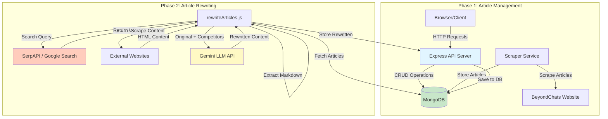

# BeyondChats Backend API

## Project Overview

A production-ready Node.js backend system for scraping, managing, and rewriting blog articles. The system operates in two phases:

**Phase 1**: Web scraping and article management system that scrapes articles from BeyondChats blogs, stores them in MongoDB, and provides full CRUD REST APIs for article management.

**Phase 2**: Automated article rewriting pipeline that searches Google for competitor articles, extracts their content, uses Gemini LLM to rewrite original articles matching competitor styles, and stores rewritten versions with references.

## Local Setup Instructions

### Prerequisites

- Node.js v16.0.0 or higher
- MongoDB v4.4 or higher (local installation or MongoDB Atlas)
- SerpAPI account and API key
- Google Gemini API key

### Environment Variables

Create a `.env` file in the root directory:

```
PORT=3000
MONGODB_URI=mongodb://localhost:27017/beyondchats
NODE_ENV=development
SERPAPI_KEY=your_serpapi_key_here
GEMINI_API_KEY=your_gemini_api_key_here
```

### Installation

1. Install dependencies:
```bash
npm install
```

2. Ensure MongoDB is running on your system or configure MongoDB Atlas connection string in `.env`

3. Start the backend server:
```bash
npm start
```

For development with auto-reload:
```bash
npm run dev
```

### Phase 2 Automation Script

Run the article rewriting pipeline:
```bash
node rewriteArticles.js
```

This script will:
- Fetch articles from MongoDB
- Search Google for competitor articles
- Scrape and extract competitor content
- Rewrite articles using Gemini LLM
- Store rewritten articles in MongoDB

## Data Flow / Architecture Diagram



## API Summary

### Article Endpoints

All endpoints are prefixed with `/api/articles`

| Method | Endpoint | Description |
|--------|----------|-------------|
| POST | `/api/articles/scrape` | Scrape articles from BeyondChats and store in database |
| POST | `/api/articles` | Create a new article |
| GET | `/api/articles` | List articles with pagination |
| GET | `/api/articles/:id` | Get single article by ID |
| PUT | `/api/articles/:id` | Update article by ID |
| DELETE | `/api/articles/:id` | Delete article by ID |
| POST | `/api/articles/:id/rewritten` | Create or update rewritten article |
| GET | `/api/articles/:id/rewritten` | Get rewritten article for original article |

### Query Parameters

**GET /api/articles**
- `page` - Page number (default: 1)
- `limit` - Items per page, 1-100 (default: 10)
- `sortBy` - Field to sort by: title, author, publishedDate, scrapedAt, createdAt (default: publishedDate)
- `sortOrder` - Sort order: asc or desc (default: desc)

### Request/Response Format

**Success Response:**
```json
{
  "success": true,
  "data": {...}
}
```

**Error Response:**
```json
{
  "success": false,
  "error": "Error message"
}
```

**Paginated Response:**
```json
{
  "success": true,
  "count": 10,
  "total": 100,
  "page": 1,
  "pages": 10,
  "data": [...]
}
```

## Project Structure

```
BeyondChats-1/
├── config/
│   └── database.js          # MongoDB connection
├── controllers/
│   └── articleController.js # Business logic
├── middleware/
│   ├── errorHandler.js      # Error handling
│   ├── timeout.js           # Request timeout
│   └── validator.js         # Input validation
├── models/
│   ├── Article.js           # Article schema
│   └── RewrittenArticle.js # RewrittenArticle schema
├── routes/
│   └── articles.js          # API routes
├── services/
│   └── scraper.js           # Web scraping service
├── utils/
│   ├── AppError.js          # Custom error class
│   ├── responseHelper.js   # Response helpers
│   └── retry.js            # Retry utility
├── rewriteArticles.js       # Phase 2 automation script
└── server.js               # Express server
```

## Production Features

- Async error handling with global error handler
- Request timeouts (30s default)
- Automatic retry for external API calls (3 attempts with exponential backoff)
- Input validation for all endpoints
- Consistent API response format
- Database connection timeouts and error handling
- Graceful shutdown handling
